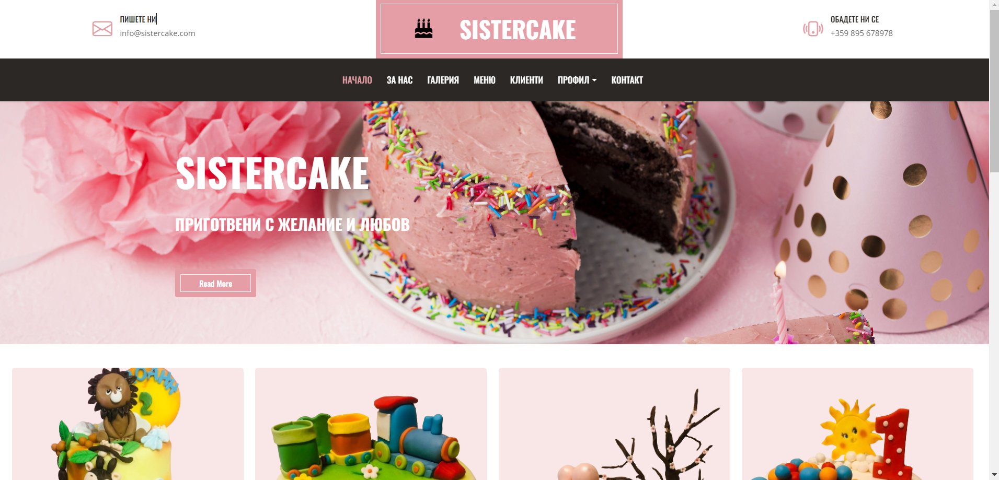
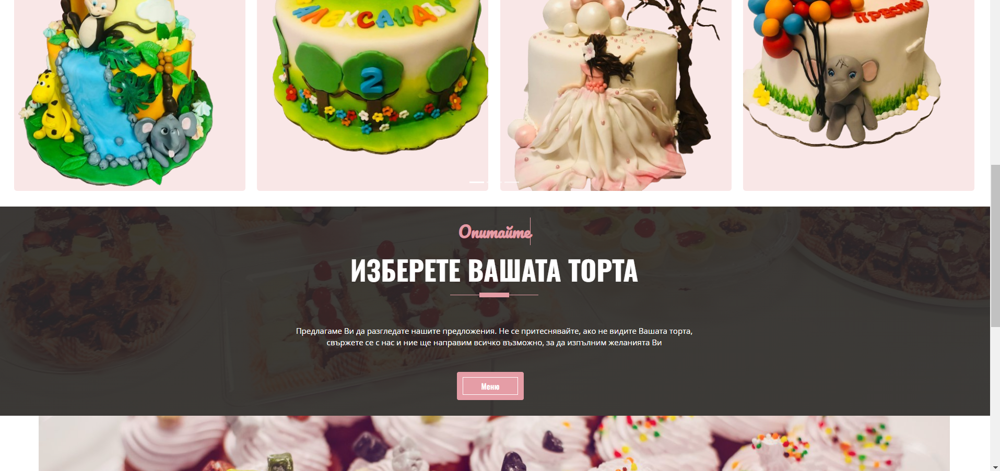
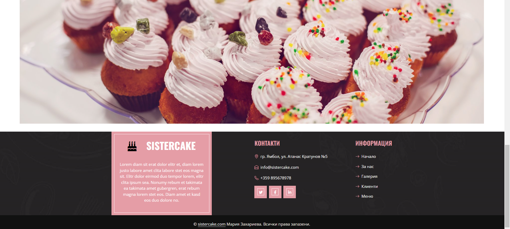
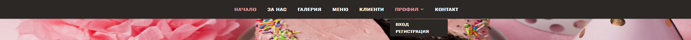
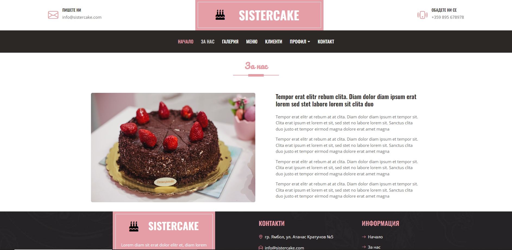
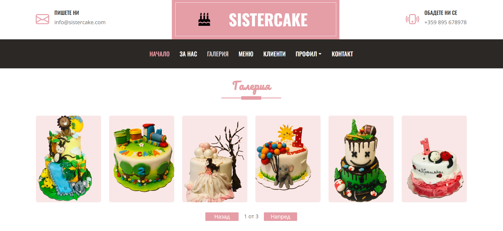
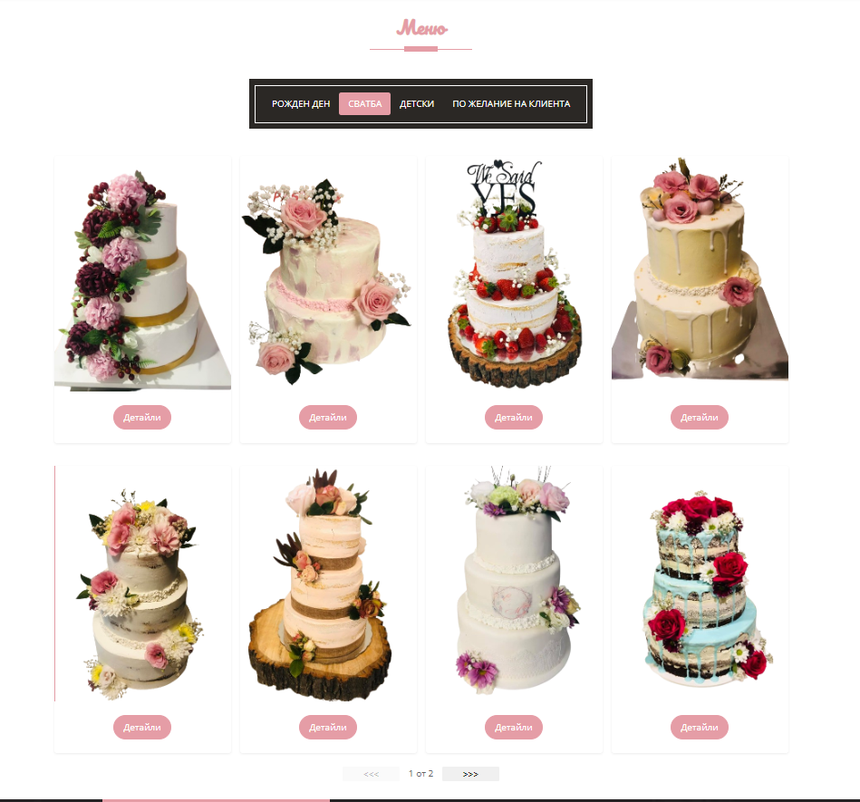

Sistercake

This is a Web Application for cake shop, using React for fron-end and SoftUni Practice server for back-end. 

The site have piblic part and private part. 

All visitors can view gallery, menu and comments, but only registere users can avantage of the full functionality of the application. Registered users can read, post, edit, like (if they are not the owner of the comment) and delete comments, they can see details of cakes and make purchases.

Navigation Bar for guests
 

Navigation bar for users

Home page

Public page for all users. The header with navigation, banner, cake images from gallery, menu shortcut and footer.

For us

Public page for all users. Info for the Sistercake shop and image.

Gallery

Public page for all users. Тhere are pictures of cakes that can be viewed. Тhey are loaded from the server with get request. Have pagination for images and animation animation on initial loading of images.

Menu

This page contains four categories of cakes that all users can see, but only registered users can see details and buy the cake. Each category contains several photos that are displayed using pagination.

Coomments

The page containt comments of users for cakes. All users can see these comments, but only registed user can create comment, read details of comment and like comment.

Profil

Login and Register page only for guest users. If have login user he can see Exit button.

Contacts

Options for contacting the company are listed.

