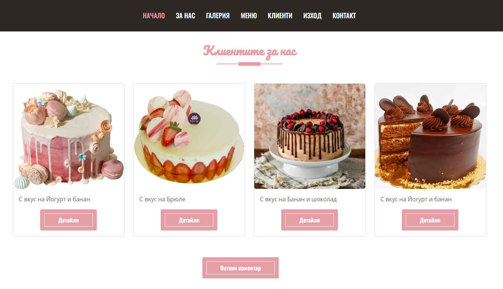
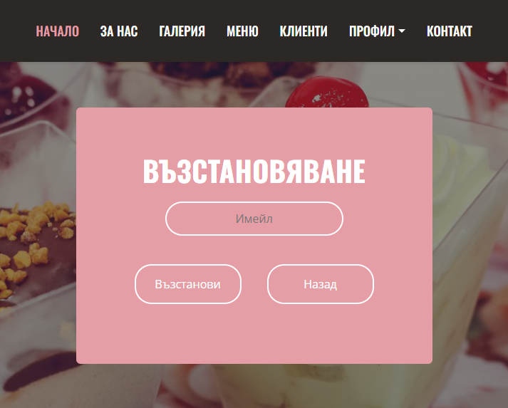

Sistercake

This is a Web Application for cake shop, using React for fron-end and SoftUni Practice server for back-end. 

The site have piblic part and private part. 

All visitors can view gallery, menu and comments, but only registere users can avantage of the full functionality of the application. Registered users can read, post, edit, like (if they are not the owner of the comment) and delete comments, they can see details of cakes and make purchases.

Navigation Bar for guests

Navigation bar for users

Home page

Public page for all users. The header with navigation, banner, cake images from gallery, menu shortcut and footer.

For us

Public page for all users. Info for the Sistercake shop and image.

Gallery

Public page for all users. Тhere are pictures of cakes that can be viewed. Тhey are loaded from the server with get request. Have pagination for images and animation animation on initial loading of images.

Еach picture can be opened in a separate window, so it can be seen in a larger size

Menu

This page contains four categories of cakes that all users can see, but only registered users can see details and buy the cake. Each category contains several photos that are displayed using pagination.

If guests wants to see the details of a cake, they must be logged in, so they are redirected to the login page

If a user wants to see the details of a cake, he is redirected to a page where he can buy the cake

Coomments

The page containt comments of users for cakes.
 

All users can see these comments, but only registed user can create comment, read details of comment and like comment.

  

When details are clicked, if the user is the owner of the comment, they can delete or edit it, but if the comment belongs to another user, they can like it

Comment can be liked by a user only once.
 

If the user tries to like the comment a second time, he gets a message that he has already liked it.

Profile

Login and Register page only for guest users. If have login user he can see Exit button. 

  

If the user has forgotten his password, he can recover it by the email

Contacts
Options for contacting the company are listed.

